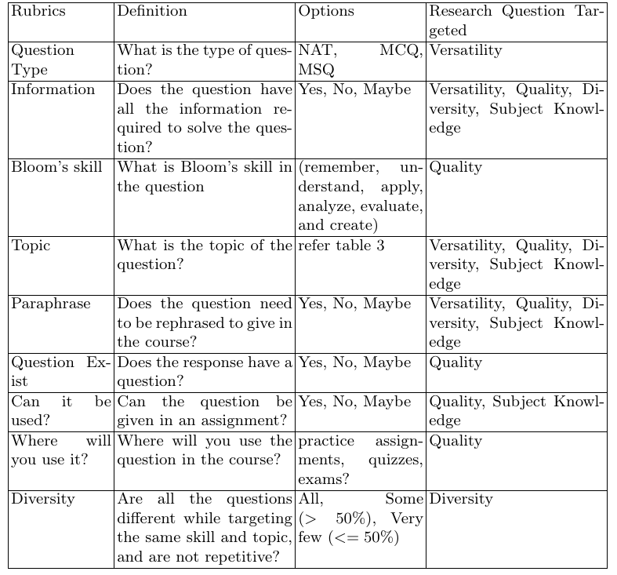

# Can Open Source LLMs Generate Math Questions at Graduate Level Courses? An Empirical Study of Linear Algebra Course

# Abstract
This study investigates the suitability of existing pre-trained
LLMs in generating questions for linear algebra courses at the graduate
level. A total of ten LLMs are included in the study where eight LLMs
are pre-trained on a Math corpora and two models are pre-trained on a
general text corpora. The study is done in two phases: (I) In the Phase
I, LLMs are tested for their understanding of graduate-level linear alge-
bra text and their ability to generate relevant questions. Based on the
analysis, three suitable LLMs among ten LLMs were selected for Phase
II study, (II) In Phase II, these selected LLMs were tested for versatil-
ity, quality, diversity, and subject knowledge. The evaluation was done
by seven experts who studied mathematics including linear algebra at
graduate levels in diverse geographical locations. The results show that
these LLMs understand linear algebra concepts and can generate diverse,
and versatile questions with lower-order thinking skills. However, the
questions generated by LLMs are not always on par with graduate-level
standards.

# Evaluation Metrics
## Phase I Evaluation Metrics
- subject understanding: Does the response have linear algebra text? (Yes/No)
- presence of questions: Does the response have a question? (Yes/No).

## Phase II Evaluation Metric

# Citation
Please acknowledge this work if you use it.

A. Bhushan, N. Bhatt, A. Bhowmick1, P. V. Ndowo2, S. T. Naik2, R. M. Pembe, and A. A. P. M. Shums, Can Open Source LLMs Generate Math Questions at Graduate Level Courses? An Empirical Study of Linear Algebra Course, AIED, 2025 
